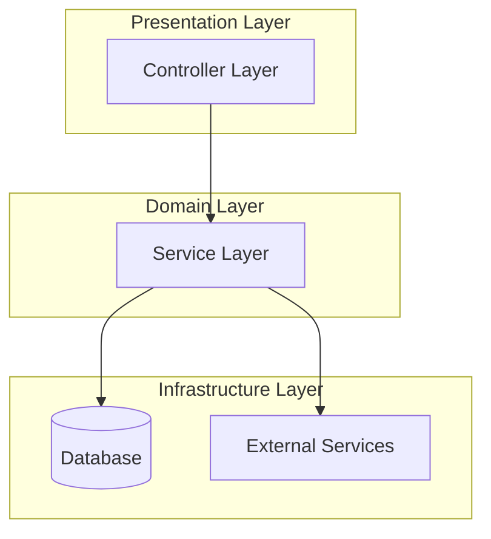

# Flowscribe – Automated C4 Architecture Analysis & Documentation

## Overview
Flowscribe automates generation, visualization, and review of multi-level C4 architecture models for large repositories.
It integrates static analysis (Deptrac), dynamic LLM review (context-aware prompts), and cost tracking (usage-first accounting)
to produce end-to-end architecture insights.

## Project Structure

```
Flowscribe/
├── .github/              # GitHub Actions workflows and templates
│   └── workflows/        # CI/CD pipeline definitions
├── docs/                 # Documentation
│   ├── CODING_STANDARDS.md  # Coding standards and best practices
│   ├── prompts/          # LLM prompts for architecture analysis
│   └── TODO.md           # Development tasks and roadmap
├── scripts/              # Main application scripts
│   ├── c4-level1-generator.py      # C4 Level 1 (System Context) generator
│   ├── c4-level2-generator.py      # C4 Level 2 (Container) generator
│   ├── c4-level3-generator.py      # C4 Level 3 (Component) generator
│   ├── c4-level4-generator.py      # C4 Level 4 (Code) generator
│   ├── c4-architecture-review.py   # Architecture review generator
│   ├── create-master-index.py      # Master index aggregator
│   ├── flowscribe-analyze.py       # Main orchestration script
│   ├── flowscribe_utils.py         # Shared utilities (LLM client, cost tracking)
│   ├── logger.py                   # Logging configuration
│   ├── constants.py                # Centralized constants
│   ├── error_sanitizer.py          # Error message sanitization
│   ├── config_validator.py         # Configuration validation
│   └── sanitize_output_files.py    # Output file sanitizer
├── tests/                # Test suite
│   ├── unit/             # Unit tests
│   ├── integration/      # Integration tests
│   └── conftest.py       # Pytest configuration
├── .env.example          # Example environment variables
├── .gitignore            # Git ignore patterns
├── CHANGELOG.md          # Version history and changes
├── CODE_QUALITY_IMPROVEMENTS_SUMMARY.md  # Code quality tracking
├── CONTRIBUTING.md       # Contribution guidelines
├── Dockerfile            # Docker container definition
├── docker-compose.yml    # Docker Compose configuration
├── LICENSE               # MIT License
├── README.md             # This file
├── requirements.txt      # Python dependencies
├── requirements-dev.txt  # Development dependencies
├── SECURITY.md           # Security policy
├── Setup.md              # Setup and installation guide
└── Task-List.md          # Project task tracking
```

### Key Directories

- **`scripts/`**: Contains all Flowscribe Python scripts for C4 generation and analysis
- **`tests/`**: Comprehensive test suite with unit and integration tests
- **`docs/`**: Project documentation including coding standards and prompts
- **`.github/`**: CI/CD workflows and GitHub configuration

### Typical Project Locations

When analyzing projects, Flowscribe uses the following default paths:

- **Workspace directory**: `/workspace/projects/` (configurable via `--workspace`)
- **Output directory**: `/workspace/output/` (configurable via `--output`)
- **Clone location**: `{workspace}/{project-name}/`
- **Generated docs**: `{output}/{project-name}/`

Example:
```bash
# Project is cloned to:
/workspace/projects/WordPress/

# Documentation is generated in:
/workspace/output/WordPress/
├── c4-level1.md
├── c4-level2.md
├── c4-level3-*.md
├── c4-level4.md
├── architecture-review.md
└── master-index.md
```

## Core Features
- Automated C4 Level 1–4 document generation
- AI-driven architecture review using premium LLMs (Sonnet 4.5, Xi Fast Code)
- Cost-aware metrics and usage validation (OpenRouter accounting)
- Provenance stamping and audit logging
- Extensible Mermaid-based visualization with Deptrac layer integration

## Architecture & Workflow
Flowscribe follows a modular pipeline:

1. **Dependency Analysis (Deptrac)** – Identifies cross-layer calls and structural violations.
2. **C4 Model Generation** – Sequential L1 → L4 markdown generation using task-specific LLM prompts.
3. **Architecture Review** – Deep architectural inspection with Sonnet 4.5, outputting recommendations.
4. **Metrics Aggregation** – Canonicalized metrics schema (v1.0) across all scripts for uniform cost tracking.
5. **Visualization Rendering** – Rich layered overview using Mermaid with true inter-layer arrows.
6. **Validation & Provenance** – Hash-stamped outputs for reproducibility and verification.

## Visualization
Flowscribe’s visualization layer uses the Deptrac ruleset to render actual dependencies between layers.

### Example: Inter-Layer Dependency Diagram (via Deptrac Ruleset)


> **Note:** Layers with no direct dependencies are displayed in gray for completeness.

## Metrics & Costing
Flowscribe adopts a **usage-first** approach where all cost metrics are sourced directly from OpenRouter API usage data.
Each script reports metrics in a canonical schema:

| Field | Description |
|-------|--------------|
| `model` | LLM model used (e.g., claude-sonnet-4.5) |
| `tokens_in` / `tokens_out` | Prompt and completion tokens |
| `cost_usd` | Cost derived from OpenRouter accounting |
| `duration_sec` | Execution time |
| `source` | Script or level producing this metric |

### Example Cost Summary (aggregated)
| Stage | Model | Cost (USD) | Tokens (in/out) | Duration (s) |
|--------|--------|-------------:|-----------------:|-------------:|
| 🧭 C4 Level 1 | gpt-4o-mini | 0.0065 | 2,345 / 2,001 | 58.3 |
| 🏗️ C4 Level 2 | gpt-4o-mini | 0.0102 | 4,231 / 3,765 | 102.1 |
| 🧩 C4 Level 3 | gpt-4o-mini | 0.0087 | 3,221 / 2,998 | 95.4 |
| ⚙️ C4 Level 4 | claude-sonnet-4.5 | 0.0198 | 8,750 / 7,690 | 165.4 |
| 🧱 Architecture Review | claude-sonnet-4.5 | 0.0133 | 8,750 / 7,690 | 165.4 |
| 💼 **TOTAL** |  | **$0.0585** | **27,297 / 24,144** | **586.6** |

_Legend: “in” = prompt tokens, “out” = completion tokens. Costs use OpenRouter usage accounting._

## Validation & Provenance
All generated files include provenance stamps for traceability:

- **Hashing** – Each markdown is SHA256-hashed post-generation.
- **Versioning** – Scripts include `flowscribe_utils` version stamps.
- **Verification tools** –
  - `flowscribe verify-metrics` validates metrics schema conformance.
  - `flowscribe verify-costs` reconciles with OpenRouter usage data.

## Roadmap

### Phase 1 (Completed ✅)
- Canonical metrics schema (v1.0)
- Usage-first cost tracking
- Violations table (Level 2)
- Dynamic LLM-based architecture review
- Mermaid rich layered visualization

### Phase 2 (In Progress 🚧)
- Full provenance and validation chain
- Cost reconciliation from OpenRouter dashboard
- Metrics aggregator (flowscribe-analyze)
- Multi-repo and plugin support
- Rule-weighted dependency visualization

### Phase 3 (Planned 🧩)
- Multi-threaded generation
- Interactive dashboards (metrics + visualization)
- Integration with CI/CD pipelines
- Enhanced audit trail and anomaly detection

## License
© 2025 Flowscribe Project. MIT License.
