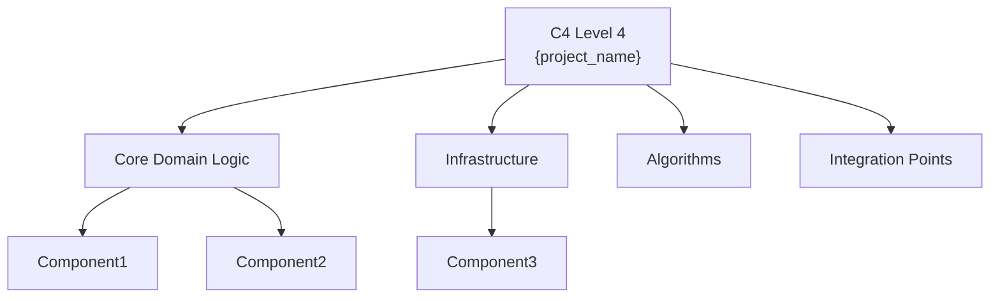
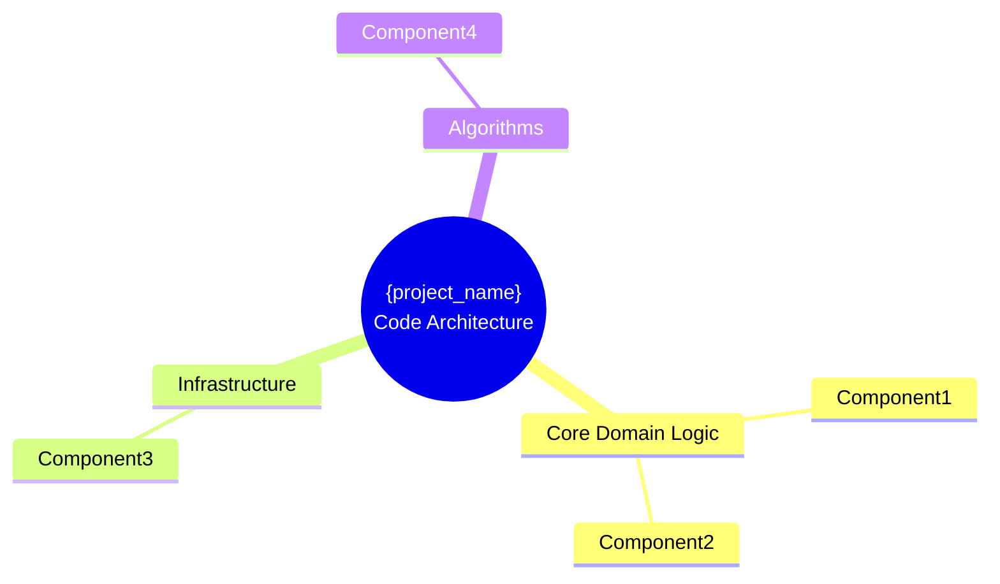

# C4 Level 4 - Hub Overview Diagram

You are an expert at creating clear, professional architecture overview diagrams.

## Project Information

**Project:** {project_name}
**Domain:** {domain}

## Selected Components for Level 4 Documentation

**Total Components:** {total_components}

{components_by_category}

## Your Task

Generate a Mermaid diagram that visualizes ALL {total_components} selected components organized by their architectural category.

### CRITICAL - Mermaid Syntax Safety Rules

**Node IDs:**

- Use only alphanumeric characters and underscores
- NO spaces, hyphens, or special characters in IDs
- Good: `UserService`, `Auth_Handler`, `DB1`
- Bad: `User Service`, `Auth-Handler`, `DB#1`

**Node Labels:**

- If label contains spaces, parentheses, colons, or special characters → wrap in double quotes
- Always quote labels with ` ` tags
- Escape internal quotes with backslash: `\"`
- Good: `User["User Service"]`, `P1["Priority: High Status: Active"]`
- Bad: `User[User Service]`, `P1[Priority: High\nStatus: Active]`

**Special Characters:**

- Replace `(` and `)` with `-` OR wrap entire label in quotes
- Replace `&` with `and`
- Use ` ` for line breaks (NOT `\n`)

### Recommended Diagram Structure

Use a **flowchart** or **mindmap** to organize components by category.

**CRITICAL: Use SINGLE curly braces for any class bodies in Mermaid!**

**Option 1: Flowchart (Recommended)**

**Option 2: Mindmap**

**SYNTAX WARNING:**

- ✅ CORRECT: Flowchart/mindmap nodes use `[]` or `()` for labels
- ❌ WRONG: Don't use `{{}}` for class-like syntax in flowcharts
- If using class diagrams: `class MyClass { +method() }` (single braces only!)

### Styling Guidelines

- Group components by their category
- Use clear, descriptive labels
- Show ALL {total_components} components (no "... N more" pattern here)
- Use color coding if possible (optional):
  - Core Domain: Green
  - Infrastructure: Blue
  - Algorithms: Orange
  - Integration: Purple
- Ensure all node IDs are safe (alphanumeric + underscore only)
- Ensure all labels with spaces/special chars are quoted

### Category Distribution

{category_distribution}

Generate ONLY the Mermaid code block. No explanations, no markdown fence markers.
