# Layer Health Overview Diagram

Generate a Mermaid diagram showing architectural health metrics for each layer.

## Requirements

1. **Visual Style**: Use a flowchart with styled subgraphs for each layer
2. **Color Coding**:
   - Green (#d4edda): 0% violations (excellent health)
   - Yellow (#fff3cd): <1% violations (good health)
   - Orange (#ffe5cc): 1-5% violations (warning)
   - Red (#f8d7da): >5% violations (critical)

3. **Content for Each Layer**:
   - Layer name
   - File count
   - Violation count
   - Percentage
   - Health indicator emoji:
     - ✅ for 0%
     - ⚠️ for <1%
     - 🚨 for ≥1%

4. **Layout**: Vertical flow (TB) with layers stacked
5. **Arrows**: Show dependency flow between layers based on ruleset

## Example Structure

```mermaid
flowchart TB
    subgraph Core_Layer["Core Layer"]
        Core["📊 2,847 files<br/>✅ 0 violations (0.0%)<br/><br/>Health: Excellent"]
    end
    
    subgraph Admin_Layer["Admin Layer"]
        Admin["📊 412 files<br/>⚠️ 10 violations (2.4%)<br/><br/>Health: Good"]
    end
    
    Core --> Admin
    
    style Core_Layer fill:#d4edda,stroke:#28a745,stroke-width:2px
    style Admin_Layer fill:#fff3cd,stroke:#ffc107,stroke-width:2px
```

## Important Notes

- Use ` ` for line breaks (NOT `\n`)
- Use SINGLE curly braces `{ }` not double `{{ }}`
- Each layer gets its own subgraph
- File counts should be formatted with commas (e.g., "2,847")
- Violation percentage should show 1 decimal place
- Include dependency arrows based on the ruleset provided

## Output

Generate ONLY the Mermaid diagram code. No explanations.
